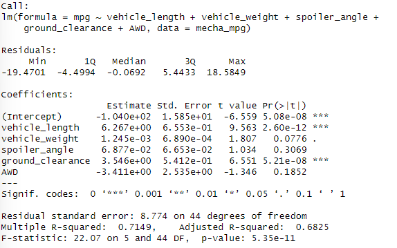
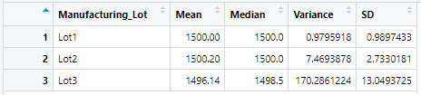
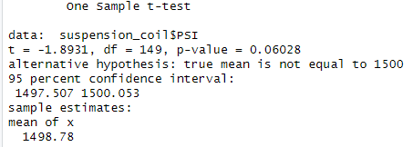
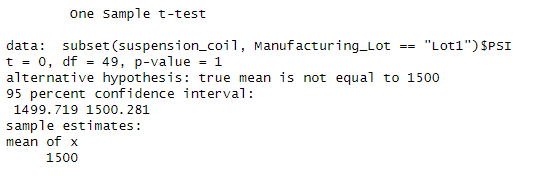
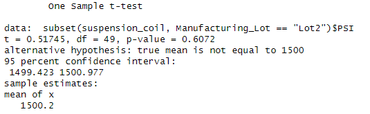
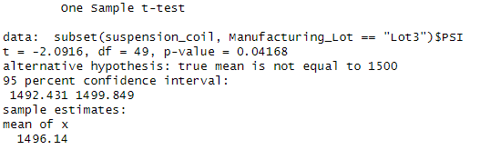

# MechaCar Analysis - Module 16 Challenge
UNC Chapel Hill Data Analytics Bootcamp

## Overview of Project
For Module 16, R was used to analyze data for MechaCar prototypes.

## Method & Results
### Part 1 - Linear Regression to Predict MPG

* Which variables/coefficients provided a non-random amount of variance to the mpg values in the dataset?
  * Using the multiple linear regression summary (under the <i>coefficients</i> section), the p-value (<i>Pr(>|t|)</i>) for both vehicle length and ground clearance are below the level of significance (<0.05%), showing that they provide a non-random amount of variance to the mpg values in the dataset. Through this, it can be concluded that vehicle length and ground clearance significantly impact a car's mpg.
* Is the slope of the linear model considered to be zero? Why or why not?
  * The linear model for mpg, according to the prediction, is roughly `mpg = 6.267*vehicle_length + 0.00125*vehicle_weight + 0.0688*spoiler_angle + 3.546*ground_clearance - 3.411*AWD - 104.0` . The slope cannot be considered to be zero because the coefficients for most variables are non-negligible. The p-value for the total linear regression (intercept) is also below the level of significance, showing that the overall slope of the linear model is not zero.
* Does this linear model predict mpg of MechaCar prototypes effectively? Why or why not?
  * The linear model does not predict the mpg of MechaCar prototypes particularly effectively. The multiple r-squared value is 0.7149, or 71.49%, showing that only 71.49% of the variability of the mpg model is accounted for with the given coefficients.

### Part 2 - Summary Statistics on Suspension Coils

* The design specifications for the MechaCar suspension coils dictate that the variance of the suspension coils must not exceed 100 pounds per square inch. Does the current manufacturing data meet this design specification for all manufacturing lots in total and each lot individually? Why or why not?
  * From the total summary, the variance of 62.29 indicates that the current manufacturing does meet the design specification of not exceeding 100 pounds per square inch. However, when looking at the lot summary, lots one and two have a variance of 0.98 and 7.47, showing that they meet the design specification, but the third lot has a variance of 170.29, which is 70.29 pounds per square inch over the requirement.

### Part 3 - T-Test on Suspension Coils
All lots: 

The p-value of 0.0603 is greater than the assumed significance level of 0.05, meaning that there is not sufficient evidence to reject the null hypothesis. Therefore, the PSI across all manufacturing lots combined is statistically similar to the population mean of 1,500 pounds per square inch.

Lot 1: 

The p-value is 1, showing that the sample mean from lot 1 is exactly equal to 1,500 pounds per square inch.

Lot 2: 

The p-value is 0.607, which is higher than the significance level of 0.05. The PSI for lot 2 is statistically similar to the population mean of 1,500 pounds per square inch.

Lot 3: 

The p-value is 0.0417, which is lower than the significance level of 0.05. The PSI for lot 3 is statistically unequal to 1,500 pounds per square inch.

### Part 4 - Design a Study Comparing the MechaCar to the Competition
To compare the performance of MechaCar vehicles against competitors, here is a sample study:
* What metric or metrics are you going to test?
  * MPG (miles per gallon)
* What is the null hypothesis or alternative hypothesis?
  * Null hypothesis: MechaCar has statistically similar fuel efficiency compared to competitors' vehicles.
  * Alternative hypothesis: MechaCar has either significantly better or significantly worse fuel efficiency compared to other vehicles.
* What statistical test would you use to test the hypothesis? And why?
  * Because mpg is numerical and the sample sizes are large, a two-sample t-test will be performed.
* What data is needed to run the statistical test?
  * The mpg data of MechaCar, which has already been obtained.
  * The mpg data of one or more competition vehicles. This will need to be collected.
